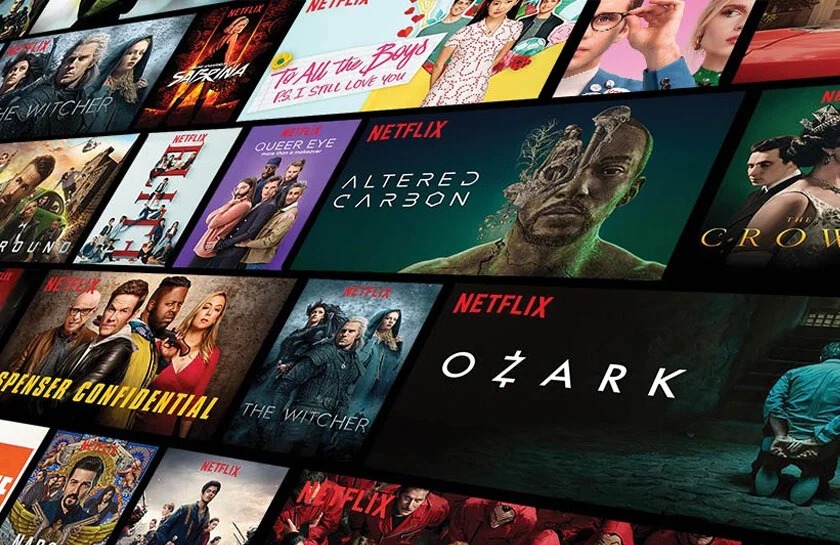

# Netflix Movies Recommender System | Content-Based Filtering  

## Introduction  
This project develops a **Content-Based Filtering** recommender system for Netflix movies using the Netflix dataset. The system suggests movies based on their similarity to a given movie by analyzing features such as genre, keywords, and descriptions.

## Problem Statement  
With the vast library of movies available on Netflix, users often struggle to find films that match their preferences. This project aims to create a recommendation system that suggests movies similar to a given selection, enhancing the user experience.

## Skill Demonstration  
- **Data Preprocessing**
- **Feature Engineering**
- **TF-IDF Vectorization**
- **Cosine Similarity Computation**
- **Recommender System Development**
- **Visualization & Evaluation**

## Data Sourcing  
The dataset used in this project comes from **Netflix's movie dataset**, containing details about movie titles, genres, descriptions, and metadata.

## Data Transformation  
- **Text Processing:** Cleaning and normalizing text data (removing stop words, punctuation, etc.).
- **Feature Extraction:** Using **TF-IDF (Term Frequency-Inverse Document Frequency)** to represent movie descriptions numerically.
- **Computing Similarities:** Applying **cosine similarity** to measure movie relevance.

## Modelling  
The recommendation system is built using **Content-Based Filtering**, which suggests movies based on their **textual similarity** to a given input movie.

## Analysis & Visualization  
- **Word Cloud of Movie Genres & Keywords**  
- **Histogram of Popular Movie Genres**  
- **Similarity Matrix for Movie Recommendations**

## Conclusion  
The **Netflix Movies Recommender System** successfully suggests movies similar to a given selection based on **content similarity**, improving personalized recommendations for users.
